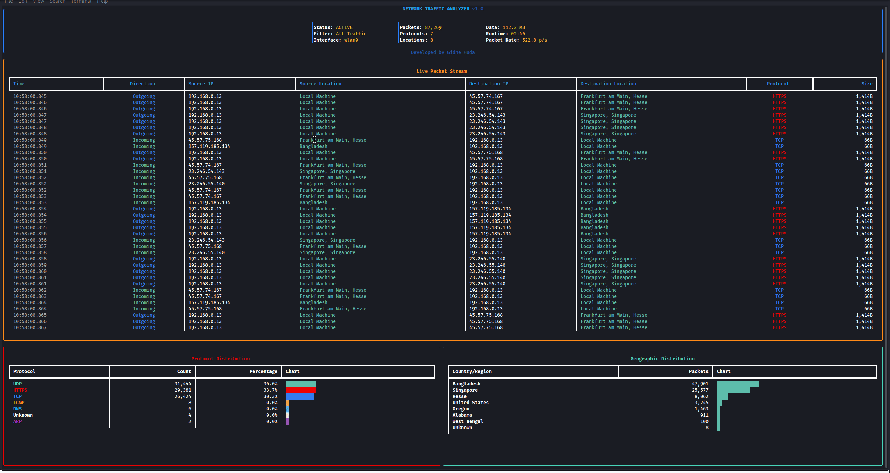

<div align="center">
   
# Network Traffic Analyzer

</div>

<div align="center">
   
[](https://python.org)
[](https://linux.org)
[](LICENSE)
[](https://github.com/jidne24/network-traffic-analyzer)

**A high-performance, real-time network packet analyzer with advanced visualization capabilities**

</div>

<p align="center">

</p>

---


## Overview

The **Network Traffic Analyzer** is an enterprise-grade network monitoring solution designed for cybersecurity professionals, network administrators, and developers. Built with Python's most robust networking libraries, it provides real-time packet analysis with zero packet loss and comprehensive protocol support.

### Why Choose This Analyzer?

- **Zero-Copy Architecture**: Optimized for minimal memory overhead
- **Thread-Safe Operations**: Concurrent capture and analysis without bottlenecks  
- **Enterprise Security**: Robust error handling and secure packet processing
- **Extensible Design**: Modular architecture for custom protocol handlers
- **Production Ready**: Battle-tested with comprehensive logging and monitoring

---


## Features

### Core Capabilities

| Feature | Description |
|---------|-------------|
| **Deep Packet Inspection** | Complete layer 2-7 protocol analysis including IPv4/IPv6, TCP/UDP, HTTP/HTTPS, DNS, SSH, FTP |
| **Real-Time Dashboard** | Interactive console interface with live packet streams, protocol distribution, and traffic metrics |
| **Geographic Intelligence** | Integrated MaxMind GeoIP2 with intelligent caching for IP geolocation |
| **High-Performance Engine** | Multi-threaded architecture with async I/O for handling high-volume traffic |
| **Advanced Filtering** | Berkeley Packet Filter (BPF) support with custom filter expressions |
| **Smart Export System** | Automated PCAP generation and JSON analytics export |
| **Security Focused** | Privilege escalation handling and secure packet processing |

---


## Architecture

```
┌─────────────────────────────────────────────────┐
│                 User Interface                  │
│              (Rich Console UI)                  │
├─────────────────────────────────────────────────┤
│            Analysis Engine                      │
│    ┌──────────────┐    ┌──────────────┐         │
│    │   Protocol   │    │    GeoIP     │         │
│    │   Decoder    │    │   Resolver   │         │
│    └──────────────┘    └──────────────┘         │
├─────────────────────────────────────────────────┤
│            Capture Engine                       │
│         (Scapy + Threading)                     │
├─────────────────────────────────────────────────┤
│              Network Layer                      │
│          (Raw Socket Interface)                 │
└─────────────────────────────────────────────────┘
```

---


## Quick Start

### System Requirements

- **Operating System**: Linux (Ubuntu 18.04+, CentOS 7+, or equivalent)
- **Python**: 3.7 or higher
- **Memory**: Minimum 2GB RAM (4GB recommended for high-traffic environments)
- **Permissions**: Root access for packet capture
- **Network**: Access to target network interface

### Installation

1. **Clone Repository**
   ```bash
   git clone https://github.com/jidne24/network-traffic-analyzer.git
   ```

2. **Environment Setup**
   ```bash
   # Create isolated Python environment
   python3 -m venv network-analyzer-env
   source network-analyzer-env/bin/activate
   
   # Upgrade pip and install dependencies
   pip install --upgrade pip setuptools wheel
   pip install -r requirements.txt
   ```

3. **GeoIP Database Configuration**
   ```bash
   # Download GeoLite2 City Database
   wget -O geoip/GeoLite2-City.mmdb "https://drive.google.com/uc?export=download&id=1QIzOCBCYsc2mAnJSbZI--MWcXZ-YGfG9"
   ```

4. **Verify Installation**
   ```bash
   # Test basic functionality
   sudo network-analyzer-env/bin/python sniffer.py --help
   ```

---


## Usage Guide

### Basic Operations

**Start Network Analysis**
```bash
# Monitor default interface with full protocol analysis
sudo network-analyzer-env/bin/python sniffer.py -i eth0
```

### Advanced Filtering

**Protocol-Specific Capture**
```bash
# HTTPS traffic analysis
sudo network-analyzer-env/bin/python sniffer.py -i eth0 -f "tcp port 443"

# DNS query monitoring
sudo network-analyzer-env/bin/python sniffer.py -i wlan0 -f "udp port 53"

# Exclude internal traffic
sudo network-analyzer-env/bin/python sniffer.py -i eth0 -f "not net 192.168.0.0/16"
```

**Complex Filter Examples**
```bash
# Web traffic excluding images
sudo network-analyzer-env/bin/python sniffer.py -i eth0 -f "tcp port 80 or tcp port 443"

# Email protocols
sudo network-analyzer-env/bin/python sniffer.py -i eth0 -f "tcp port 25 or tcp port 110 or tcp port 143"

# P2P and streaming detection
sudo network-analyzer-env/bin/python sniffer.py -i eth0 -f "tcp portrange 6881-6999"
```

### Interactive Controls

| Key Combination | Action |
|-----------------|---------|
| `Ctrl + C` | Graceful shutdown with report generation |
| `Ctrl + Z` | Pause capture (resume with `fg`) |
| `q` | Quick exit (in dashboard mode) |

---


## Output & Analysis

### Generated Reports

The analyzer generates comprehensive reports in the `Output/` directory:

#### 1. PCAP File (`network_capture.pcap`)
- **Format**: Standard PCAP format compatible with Wireshark, tcpdump
- **Contents**: Raw packet data with full headers and payloads
- **Size**: Automatically rotated at 1GB intervals

#### 2. Analytics Report (`network_stats.json`)
```json
{
  "session_info": {
    "start_time": "2025-01-15T10:30:00Z",
    "duration_seconds": 3600,
    "total_packets": 125430,
    "total_bytes": 89234567
  },
  "protocol_distribution": {
    "TCP": 78234,
    "UDP": 35678,
    "ICMP": 11518
  },
  "geographic_distribution": {
    "United States": 45230,
    "Germany": 23456,
    "Japan": 12789
  },
  "top_talkers": {
    "192.168.1.100": {"packets": 5678, "bytes": 4567890},
    "10.0.0.50": {"packets": 4321, "bytes": 3456789}
  }
}
```

### Integration with External Tools

**Wireshark Analysis**
```bash
# Open captured data in Wireshark
wireshark output/network_capture.pcap
```

**Command-Line Analysis**
```bash
# Quick statistics with tcpdump
tcpdump -nn -r output/network_capture.pcap | head -20

# Protocol distribution
tcpdump -nn -r output/network_capture.pcap | awk '{print $3}' | sort | uniq -c | sort -nr
```

---


## License

This project is licensed under the MIT License - see the [LICENSE](LICENSE) file for details.

### Third-Party Acknowledgments

- **Scapy**: Packet manipulation library
- **Rich**: Terminal formatting and UI components  
- **MaxMind**: GeoIP2 database and Python library
- **Python Software Foundation**: Core Python runtime

---


<div align="center">

### Star this repository if you find it useful!

**Developed with ❤️ by [Gidne Huda](https://github.com/jidne24)**

*Making network analysis accessible to everyone*

[](https://github.com/jidne24/network-traffic-analyzer/stargazers)
[](https://github.com/jidne24/network-traffic-analyzer/network/members)
[](https://github.com/jidne24/network-traffic-analyzer/issues)

</div>
